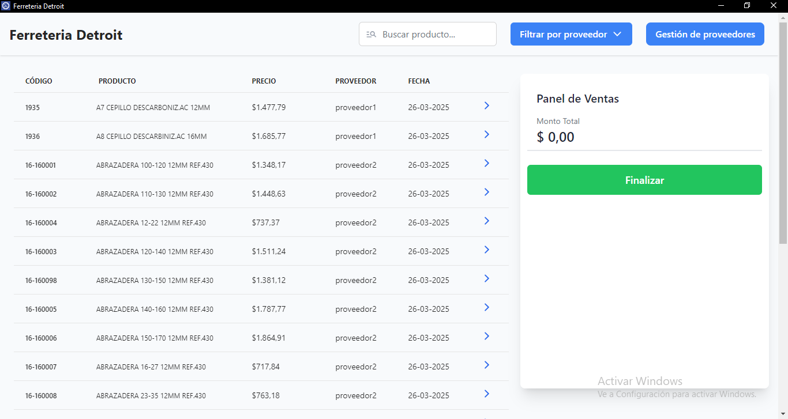

<div align="center" style="display: flex; align-items: center; justify-content: center; gap: 18px;">
    
    <h1 style="font-size:2.8em; font-weight:bold;">Blynt</h1>
</div>

<p align="center"><em>Sistema de gestión de productos y proveedores para ferretería (desarrollado originalmente para Ferretería Detroit).</em></p>

---

---

## ✔️ Características principales

- **Gestión de productos**: Alta, baja, modificación y filtrado de productos.
- **Gestión de proveedores**: Administración de proveedores y sus archivos asociados.
- **Carga y edición de archivos Excel**: Subida, visualización y edición de archivos de productos.
- **ETL automatizado**: Extracción, transformación y carga de datos desde archivos Excel.
- **Interfaz intuitiva**: Frontend moderno y responsivo con React y TailwindCSS.

---

---

## 🖼️ Vista rápida

<p align="center">
 
</p>

---

## 📦 Estructura del proyecto

```text
product-management-system/
├── assets/           # Imágenes y multimedia para la documentación
│   ├── icon-logo.png
│   └── lista-de-productos.png
├── backend/          # Backend Django (API, lógica de negocio, ETL)
├── frontend/         # Frontend React (UI, consumo de API)
└── README.md         # Documentación principal
```

---

## ⚙️ Instalación rápida

### 1. Clona el repositorio

```bash
git clone https://github.com/NavierCracco/supplier-product-management-system.git
cd supplier-product-management-system/product-management-system
```

### 2. Backend (Django)

```bash
cd backend
python -m venv venv
venv\Scripts\activate  # En Windows
pip install -r requirements.txt
python manage.py migrate
python manage.py runserver
```

### 3. Frontend (React)

```bash
cd ../frontend
npm install
npm run dev
```

---

## 🖥️ Uso

- Accede a la interfaz web en [http://localhost:5173](http://localhost:5173) (por defecto).
- El backend corre en [http://localhost:8000](http://localhost:8000).
- Sube archivos Excel, gestiona productos y proveedores desde la UI.

---

## 📝 Tecnologías utilizadas

- **Backend**: Python, Django, Django REST Framework, SQLite
- **Frontend**: React, Vite, TailwindCSS
- **Otros**: ETL personalizado, manejo de archivos Excel

---

## 👤 Autor y contacto

Desarrollado por **Navier Cracco**

- 📧 Email: <cracconavier@gmail.com>
- 💼 [LinkedIn](https://www.linkedin.com/in/navier-cracco-7112b1252/)
- 📱 +54 342 5378014

---

> Hecho con ❤️ para la gestión eficiente de ferreterías
